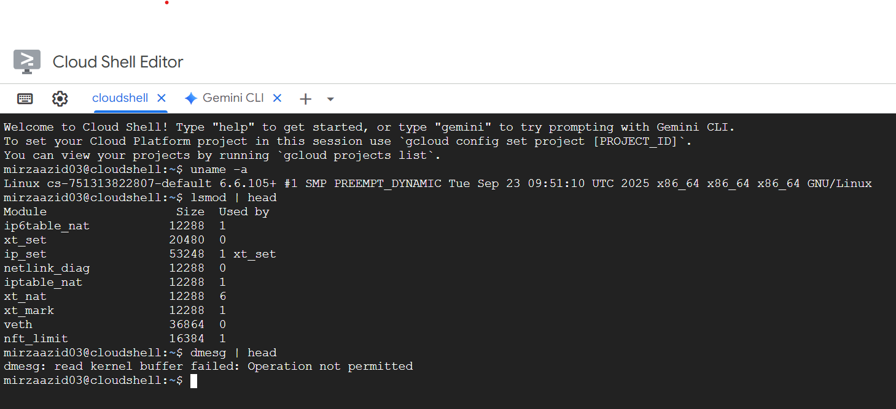

<!-- 
# Laporan Praktikum Minggu [X]
Topik: [Tuliskan judul topik, misalnya "Arsitektur Sistem Operasi dan Kernel"]

--- -->

## Identitas
- **Nama**  : Azid mirza maulana  
- **NIM**   : 250202933  
- **Kelas** : 1ikrb


---

## Tujuan  
> Mahasiswa mampu menjelaskan fungsi utama sistem operasi dan peran kernel serta system call.

---

## Dasar Teori
Pada praktikum minggu ini, mahasiswa akan mempelajari **arsitektur dasar sistem operasi**: bagaimana komponen OS bekerja, serta bagaimana interaksi antara user, aplikasi, kernel, dan hardware terjadi.  

Mahasiswa juga diperkenalkan pada:
- Perbedaan mode eksekusi **kernel mode** dan **user mode**.
- Mekanisme **system call** (panggilan sistem).
- Perbandingan model arsitektur OS seperti **monolithic kernel**, **layered approach**, dan **microkernel**.

Eksperimen akan dilakukan menggunakan perintah dasar Linux untuk melihat informasi kernel dan modul aktif.

---


---

## Langkah Praktikum
   - Pastikan Linux (Ubuntu/WSL) sudah terinstal.
   - Pastikan Git sudah dikonfigurasi dengan benar:
     ```bash
     git config --global user.name "Nama Anda"
     git config --global user.email "email@contoh.com"
     ```

2. **Diskusi Konsep**
   - Baca materi pengantar tentang komponen OS.
   - Identifikasi komponen yang ada pada Linux/Windows/Android.

3. **Eksperimen Dasar**
   Jalankan perintah berikut di terminal:
   ```bash
   uname -a
   whoami
   lsmod | head
   dmesg | head
   ```
   Catat dan analisis modul kernel yang tampil.

4. **Membuat Diagram Arsitektur**
   - Buat diagram hubungan antara *User → System Call → Kernel → Hardware.*
   - Gunakan **draw.io** atau **Mermaid**.
   - Simpan hasilnya di:
     ```
     praktikum/week1-intro-arsitektur-os/screenshots/diagram-os.png
     ```

5. **Penulisan Laporan**
   - Tuliskan hasil pengamatan, analisis, dan kesimpulan ke dalam `laporan.md`.
   - Tambahkan screenshot hasil terminal ke folder `screenshots/`.

6. **Commit & Push**
   ```bash
   git add .
   git commit -m "Minggu 1 - Arsitektur Sistem Operasi dan Kernel"
   git push origin main
   ```

---


---

## Kode / Perintah
Tuliskan potongan kode atau perintah utama:
```bash
uname -a
lsmod | head
dmesg | head
```

---

## Hasil Eksekusi
Sertakan screenshot hasil percobaan atau diagram:
![Screenshot hasil][def]

---

## Analisis
- Jelaskan makna hasil percobaan.  
- Hubungkan hasil dengan teori (fungsi kernel, system call, arsitektur OS).  
- Apa perbedaan hasil di lingkungan OS berbeda (Linux vs Windows)?  

---

## Kesimpulan
Mempelajari sistem operasi memberikan pemahaman mendalam tentang cara kerja dasar komputer dan perangkat lunak yang mengatur sumber daya sistem. Sistem operasi berperan sebagai penghubung antara perangkat keras dan pengguna, serta mengelola berbagai aspek penting seperti proses, memori, penyimpanan, dan perangkat input/output. Dengan memahami sistem operasi, kita dapat:

Mengoptimalkan penggunaan sumber daya komputer.

Meningkatkan efisiensi dan keamanan sistem.

Memahami konsep multitasking, manajemen file, dan kontrol akses.

Mempersiapkan diri untuk mengembangkan perangkat lunak yang kompatibel dan efisien.

Menyadari pentingnya sistem operasi dalam kestabilan dan kinerja sistem komputer secara keseluruhan.

Secara keseluruhan, pengetahuan tentang sistem operasi sangat penting bagi siapa pun yang ingin mendalami bidang teknologi informasi, pemrograman, atau administrasi sistem.

---

## Quiz
   - Contoh OS yang menerapkan tiap model.
   - Analisis: model mana yang paling relevan untuk sistem modern.  
3. Tambahkan hasil ke `praktikum/week1-intro-arsitektur-os/laporan.md`.

### Quiz
Jawab pertanyaan berikut di bagian **Quiz** pada laporan:
1. Sebutkan tiga fungsi utama sistem operasi.  
2. Jelaskan perbedaan antara *kernel mode* dan *user mode*.  
3. Sebutkan contoh OS dengan arsitektur monolithic dan microkernel.

---

## E. Output yang Diharapkan
- File laporan (`laporan.md`) lengkap dengan hasil observasi.  
- Diagram arsitektur OS (`diagram-os.png`).  
- File hasil terminal (`screenshots/`).  


---

## Refleksi Diri
1. susah semua dan masih kurang paham dengan pengoprasiannya

## F. Referensi
1. Abraham Silberschatz, Peter Baer Galvin, Greg Gagne. *Operating System Concepts*, 10th Edition, Wiley, 2018.  
2. Andrew S. Tanenbaum, Herbert Bos. *Modern Operating Systems*, 4th Edition, Pearson, 2015.  

---

**Credit:**  
_Template laporan praktikum Sistem Operasi (SO-202501) – Universitas Putra Bangsa_


[def]: screenshoot/