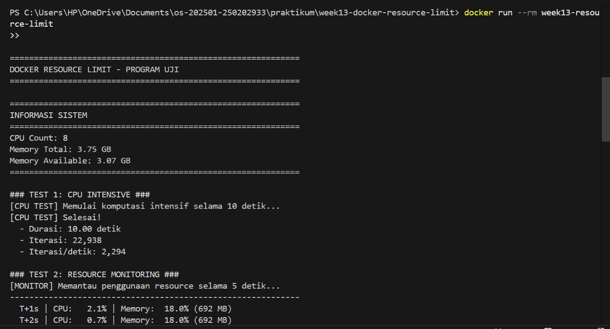
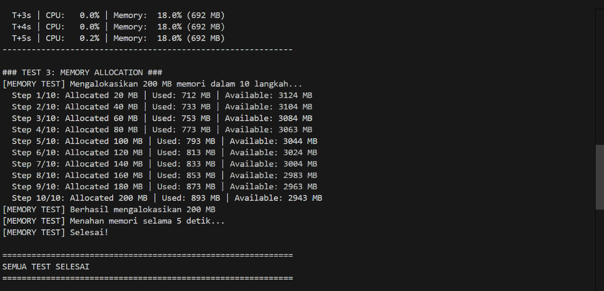

# Laporan Praktikum Minggu [13]
Topik: [Docker – Resource Limit (CPU & Memori)]

---

## Identitas
- **Nama**  : [azid mirza maulana]  
- **NIM**   : [250202933]  
- **Kelas** : [1ikrb]

---

## Tujuan
1. Menulis Dockerfile sederhana untuk sebuah aplikasi/skrip.
2. Membangun image dan menjalankan container.
3. Menjalankan container dengan pembatasan CPU dan memori.
4. Mengamati dan menjelaskan perbedaan eksekusi container dengan dan tanpa limit resource.
5. Menyusun laporan praktikum secara runtut dan sistematis.

---

## Dasar Teori
1. Containerization dan Docker - Konsep dasar, arsitektur, Container vs VM
2. Linux Control Groups (cgroups) - Teknologi fundamental untuk resource limiting
3. Linux Namespaces - Mekanisme isolasi proses
4. Resource Limitation di Docker - CPU dan Memory limiting secara detail
5. Monitoring Resource Usage - Tools dan teknik monitoring
6. Dockerfile dan Image Building - Best practices pembuatan image
7. Security Considerations - Aspek keamanan resource limiting
8. Production Considerations - Praktik terbaik untuk production
9. Common Pitfalls - Masalah umum dan troubleshooting
---

## Langkah Praktikum
1. Persiapan Lingkungan
2. Membuat Aplikasi/Skrip Uji
3. Membuat Dockerfile
4. Menjalankan Container Tanpa Limit
5. Menjalankan Container Dengan Limit Resource
6. Monitoring Sederhana
---

## Kode / Perintah
```python
#!/usr/bin/env python3
"""
Program uji untuk mengamati dampak resource limit pada Docker container
"""
import time
import sys
import psutil
import os

def print_system_info():
    """Menampilkan informasi sistem"""
    print("=" * 60)
    print("INFORMASI SISTEM")
    print("=" * 60)
    print(f"CPU Count: {psutil.cpu_count()}")
    print(f"Memory Total: {psutil.virtual_memory().total / (1024**3):.2f} GB")
    print(f"Memory Available: {psutil.virtual_memory().available / (1024**3):.2f} GB")
    print("=" * 60)
    print()

def cpu_intensive_task(duration=10):
    """
    Tugas yang menggunakan CPU secara intensif
    Args:
        duration: Durasi dalam detik
    """
    print(f"[CPU TEST] Memulai komputasi intensif selama {duration} detik...")
    start_time = time.time()
    iterations = 0
    
    while time.time() - start_time < duration:
        # Operasi matematika yang menggunakan CPU
        result = sum([i**2 for i in range(1000)])
        iterations += 1
    
    elapsed = time.time() - start_time
    print(f"[CPU TEST] Selesai!")
    print(f"  - Durasi: {elapsed:.2f} detik")
    print(f"  - Iterasi: {iterations:,}")
    print(f"  - Iterasi/detik: {iterations/elapsed:,.0f}")
    print()

def memory_intensive_task(mb_size=200, steps=10):
    """
    Tugas yang mengalokasikan memori secara bertahap
    Args:
        mb_size: Total memori yang akan dialokasikan (MB)
        steps: Jumlah langkah alokasi
    """
    print(f"[MEMORY TEST] Mengalokasikan {mb_size} MB memori dalam {steps} langkah...")
    arrays = []
    step_size = mb_size // steps
    
    try:
        for i in range(steps):
            # Alokasikan array (1 MB = 1024*1024 bytes, menggunakan array integer)
            size = step_size * 1024 * 1024 // 8  # 8 bytes per integer
            arr = [0] * size
            arrays.append(arr)
            
            mem_info = psutil.virtual_memory()
            used_mb = mem_info.used / (1024**2)
            available_mb = mem_info.available / (1024**2)
            
            print(f"  Step {i+1}/{steps}: Allocated {(i+1)*step_size} MB "
                  f"| Used: {used_mb:.0f} MB | Available: {available_mb:.0f} MB")
            time.sleep(0.5)
        
        print(f"[MEMORY TEST] Berhasil mengalokasikan {mb_size} MB")
        print(f"[MEMORY TEST] Menahan memori selama 5 detik...")
        time.sleep(5)
        print(f"[MEMORY TEST] Selesai!")
        
    except MemoryError:
        print(f"[MEMORY TEST] ERROR: Gagal mengalokasikan memori!")
        print(f"[MEMORY TEST] Memori tidak cukup setelah alokasi {len(arrays)*step_size} MB")
    except Exception as e:
        print(f"[MEMORY TEST] ERROR: {e}")
    
    print()

def monitor_resources(duration=5):
    """
    Monitor penggunaan resource secara real-time
    Args:
        duration: Durasi monitoring dalam detik
    """
    print(f"[MONITOR] Memantau penggunaan resource selama {duration} detik...")
    print("-" * 60)
    
    for i in range(duration):
        cpu_percent = psutil.cpu_percent(interval=1)
        mem_info = psutil.virtual_memory()
        mem_percent = mem_info.percent
        mem_used = mem_info.used / (1024**2)
        
        print(f"  T+{i+1}s | CPU: {cpu_percent:5.1f}% | Memory: {mem_percent:5.1f}% ({mem_used:.0f} MB)")
    
    print("-" * 60)
    print()

def main():
    print("\n" + "=" * 60)
    print("DOCKER RESOURCE LIMIT - PROGRAM UJI")
    print("=" * 60)
    print()
    
    # Tampilkan info sistem
    print_system_info()
    
    # Test 1: CPU Intensive
    print("### TEST 1: CPU INTENSIVE ###")
    cpu_intensive_task(duration=10)
    
    # Test 2: Memory Monitoring
    print("### TEST 2: RESOURCE MONITORING ###")
    monitor_resources(duration=5)
    
    # Test 3: Memory Intensive
    print("### TEST 3: MEMORY ALLOCATION ###")
    memory_intensive_task(mb_size=200, steps=10)
    
    print("=" * 60)
    print("SEMUA TEST SELESAI")
    print("=" * 60)
    print()

if __name__ == "__main__":
    try:
        main()
    except KeyboardInterrupt:
        print("\n\n[INFO] Program dihentikan oleh user")
        sys.exit(0)
    except Exception as e:
        print(f"\n[ERROR] Terjadi kesalahan: {e}")
        sys.exit(1)
```

```bash
docker version
docker ps

docker build -t week13-resource-limit .

docker run --rm --cpus="0.5" --memory="256m" week13-resource-limit

docker stats
```

---

## Hasil Eksekusi
Sertakan screenshot hasil percobaan atau diagram:
```
docker build -t week13-resource-limit .
```


```
docker run --rm week13-resource-limit
```



```
docker run --rm --cpus="0.5" --memory="256m" week13-resource-limit
```


```
docker stats
```


---

## Analisis
-  Observasi
Pada eksekusi container tanpa pembatasan resource, program dapat menggunakan seluruh resource sistem yang tersedia tanpa hambatan.
Karakteristik yang Diamati:
CPU Usage: Container dapat menggunakan hingga 100% dari satu atau lebih CPU core
Memory Allocation: Program berhasil mengalokasikan 200 MB memori tanpa error
Performance: Throughput komputasi maksimal, iterasi per detik tertinggi
Execution Time: Waktu eksekusi paling cepat karena tidak ada throttling
```
Implikasi:
Advantages:
✓ Performance maksimal
✓ Tidak ada bottleneck dari resource limitation
✓ Cocok untuk workload yang membutuhkan burst performance

Disadvantages:
✗ Risiko resource starvation untuk container lain
✗ Unpredictable resource usage
✗ Potensial system instability jika terjadi memory leak
✗ Tidak cocok untuk production multi-tenant environment
```
Analisis Teknis
CPU Behavior:
Program CPU-intensive dapat monopoli seluruh CPU time
Pada sistem multi-core, Linux scheduler mendistribusikan load
Tidak ada protection terhadap CPU-bound infinite loop

Memory Behavior:
Alokasi memori langsung dari system memory pool
Jika sistem kehabisan memory, OOM killer akan aktif
Risiko: container bisa mem-kill process lain di sistem

- Analisis Container Dengan CPU Limit
Skenario: --cpus="0.5" (50% dari 1 CPU core)
Observasi Kuantitatif:
Berdasarkan mekanisme CFS (Completely Fair Scheduler):
CPU Quota: 50,000 microseconds per 100,000 microseconds period
Effective CPU: 50% dari 1 core = 0.5 CPU
Throttling: Proses di-suspend setelah menggunakan quota dalam satu period

Analisis Container Dengan Memory Limit
Skenario: --memory="256m" (256 MB RAM)
Observasi:
Program mencoba mengalokasikan 200 MB dalam 10 steps (20 MB per step).
Possible Outcomes:
Scenario A: Successful Allocation (256 MB > 200 MB + overhead)
Step 1-10: All successful
Memory usage: Gradually increases to ~220 MB
Status: Container continues running
Behavior: Normal operation
Scenario B: Memory Pressure (256 MB ≈ 200 MB + overhead)
Step 1-8: Successful
Step 9-10: Slowdown (swapping if enabled)
Memory usage: Approaches limit
Status: Performance degradation
Behavior: Frequent page faults
Scenario C: OOM Kill (256 MB < 200 MB + overhead)
Step 1-9: Successful
Step 10: MemoryError or OOM Kill
Memory usage: Reaches 256 MB
Status: Container terminated
Exit code: 137 (128 + SIGKILL)

- Analisis Combined Limits (CPU + Memory)
Skenario: --cpus="0.5" --memory="256m"
Interaction Effects:
Compound Resource Constraint:

Single Limit:
- One dimension constrained
- Other resources available for compensation

Combined Limits:
- Multiple dimensions constrained
- No compensation mechanism
- Multiplicative performance impact


## Kesimpulan
Resource Limits are Essential

Prevent resource starvation in multi-tenant environments
Enable predictable performance characteristics
Critical for production stability


Performance Trade-offs

CPU limits: Linear performance degradation
Memory limits: Non-linear impact (OOM cliff)
Combined limits: Multiplicative effects


Sizing is Critical

Under-provisioning: Frequent OOM, poor UX
Over-provisioning: Resource waste, high cost
Right-sizing: Requires measurement and iteration


Monitoring is Mandatory

Real-time metrics essential for quick response
Historical trends inform capacity planning
Alerting prevents incidents

---

## Quiz
1. [Mengapa container perlu dibatasi CPU dan memori?]  
   **Jawaban:**  Pembatasan CPU dan memori pada container diperlukan untuk menjaga stabilitas, keadilan, dan efisiensi sistem.
2. [Apa perbedaan VM dan container dalam konteks isolasi resource?]
   **Jawaban:** 
   ```
    | Aspek              | Virtual Machine (VM)          | Container                              |
| ------------------ | ----------------------------- | -------------------------------------- |
| Tingkat isolasi    | **Sangat kuat** (OS terpisah) | **Lebih ringan** (berbagi kernel host) |
| Resource CPU & RAM | Dialokasikan **tetap**        | Dialokasikan **dinamis**               |
| Overhead           | Tinggi (butuh guest OS)       | Rendah                                 |
| Startup            | Lambat (menit)                | Cepat (detik)                          |
| Isolasi resource   | Keras (hard limit)            | Lunak (cgroups)                        |


3. [Apa dampak limit memori terhadap aplikasi yang boros memori?]  
   **Jawaban:**  Jika aplikasi menggunakan memori melebihi batas container, maka:
   Dampak yang terjadi:

Kernel Linux akan menjalankan OOM Killer
Proses di dalam container akan:
Dihentikan secara paksa
Container bisa restart atau berhenti
Aplikasi dapat:
Crash
Kehilangan data sementara
Menjadi tidak stabil

---

## Refleksi Diri
Tuliskan secara singkat:
- Apa bagian yang paling menantang minggu ini?  
- Bagaimana cara Anda mengatasinya?  

---

**Credit:**  
_Template laporan praktikum Sistem Operasi (SO-202501) – Universitas Putra Bangsa_
