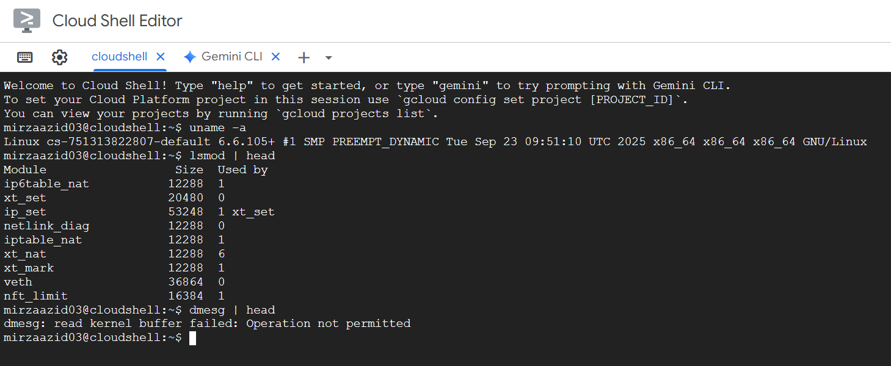

# Laporan Praktikum Minggu [X]
Topik:  "fungsi sistem call dan sistem operasi

---

## Identitas
- **Nama**  :AZID MIRZA MAULANA  
- **NIM**   : 250202933 
- **Kelas** :1IKRB


---

## Tujuan
 
> Mahasiswa mampu menjelaskan fungsi utama sistem operasi dan peran kernel serta system call.

---

## Dasar Teori
Jenis-jenis system call yang umum digunakan (file, process, device, communication).
Alur eksekusi system call dari mode user menuju mode kernel.
Cara melihat daftar system call yang aktif di sistem Linux.
---

## Langkah Praktikum
1. Langkah-langkah yang dilakukan.  
2. Perintah yang dijalankan.  
3. File dan kode yang dibuat.  
4. Commit message yang digunakan.

---

## Kode / Perintah
Tuliskan potongan kode atau perintah utama:
```bash
uname -a
lsmod | head
dmesg | head
```

---

## Hasil Eksekusi
Sertakan screenshot hasil percobaan atau diagram:

---

## Analisis
- Jelaskan makna hasil percobaan.  
- hubungkan hasil dengan teori (fungsi kernel, system call, arsitektur OS). 
yaitu bekerja sama untuk memungkinkan aplikasi berinteraksi dengan perangkat keras komputer dengan aman dan efisien. 
- Apa perbedaan hasil di lingkungan OS berbeda (Linux vs Windows)?  
Linux unggul dalam keamanan, performa, fleksibilitas, dan server.

Windows unggul dalam kemudahan penggunaan, kompatibilitas software, dan gaming.
---

## Kesimpulan
Tuliskan 2–3 poin kesimpulan dari praktikum ini.
Sistem operasi (Operating System / OS) adalah perangkat lunak utama yang mengatur seluruh aktivitas komputer, termasuk pengelolaan perangkat keras (hardware), memori, proses, dan file.
➤ Fungsinya adalah menjadi penghubung antara pengguna dan hardware, agar komputer dapat digunakan dengan mudah dan efisien.

System call adalah antarmuka (interface) antara program pengguna (user mode) dengan sistem operasi (kernel mode).
➤ Fungsinya untuk meminta layanan OS, seperti membaca file, membuat proses, atau mengirim data ke perangkat, tanpa harus mengakses hardware secara langsung.
---

## Quiz
1. [apa itusistem operasi]  
   **Jawaban:**  Sistem operasi adalah perangkat lunak utama (software) yang mengatur dan mengendalikan seluruh aktivitas di dalam komputer.
OS berfungsi sebagai penghubung antara pengguna (user) dengan perangkat keras (hardware) agar komputer dapat digunakan dengan mudah dan efisien.
2. [apa itu sistem call]  
   **Jawaban:**  System call (panggilan sistem) adalah mekanisme atau jembatan yang memungkinkan program aplikasi (user) berinteraksi dengan sistem operasi (kernel).
3. [Pertanyaan 3]  
   **Jawaban:**  

---

## Refleksi Diri
Tuliskan secara singkat:
- kesulitan untuk mencari materi tentang sistem call dan sistem operasi 
- mememperbanyak mencari materi dari sumber manapun

System Call dan Sistem Operasi

Sistem operasi (Operating System/OS) adalah perangkat lunak sistem yang berfungsi sebagai penghubung antara pengguna dengan perangkat keras komputer. Tanpa sistem operasi, pengguna tidak dapat berinteraksi secara langsung dengan perangkat keras karena bahasa mesin sulit dimengerti oleh manusia. Oleh karena itu, sistem operasi menyediakan antarmuka dan layanan agar program aplikasi dan pengguna dapat menggunakan sumber daya komputer dengan mudah, efisien, serta aman.

Secara umum, sistem operasi memiliki beberapa fungsi utama, yaitu manajemen proses, manajemen memori, manajemen penyimpanan (file system), serta manajemen perangkat input/output. Selain itu, sistem operasi juga bertugas mengatur keamanan, akses pengguna, dan komunikasi antarproses. Beberapa contoh sistem operasi yang populer adalah Windows, Linux, macOS, dan Android. Masing-masing memiliki arsitektur dan mekanisme sistem panggilan (system call) yang berbeda, namun tujuannya sama: menyediakan layanan bagi program agar dapat menggunakan fungsi-fungsi perangkat keras tanpa harus mengendalikannya secara langsung.

Di sinilah peran system call menjadi sangat penting. System call adalah mekanisme yang digunakan oleh program aplikasi untuk meminta layanan dari kernel sistem operasi. Kernel adalah inti dari sistem operasi yang memiliki hak akses penuh terhadap perangkat keras. Dengan adanya system call, aplikasi dapat melakukan operasi seperti membaca dan menulis berkas, membuat proses baru, mengalokasikan memori, atau berkomunikasi dengan perangkat tanpa harus mengetahui detail teknis dari perangkat keras tersebut.

Contoh sederhana system call adalah ketika suatu program ingin membuka file. Program tidak langsung mengakses hard disk, tetapi mengirimkan permintaan ke sistem operasi melalui system call seperti open. Kernel kemudian memproses permintaan tersebut, mengakses file yang dimaksud, dan mengembalikan hasilnya ke program. Dengan cara ini, sistem operasi bertindak sebagai perantara yang menjamin keamanan dan stabilitas sistem, karena hanya kernel yang diperbolehkan mengakses perangkat keras secara langsung.

Terdapat beberapa kategori utama dalam system call, yaitu:

Process Control – mencakup pembuatan, penghentian, dan sinkronisasi proses.

File Management – mengatur operasi file seperti membuka, membaca, menulis, dan menutup file.

Device Management – berhubungan dengan penggunaan perangkat input/output.

Information Maintenance – mengatur dan mengakses informasi sistem, seperti waktu atau status proses.

Communication – mengatur komunikasi antarproses atau antar komputer.

Perbedaan antara sistem operasi seperti Linux dan Windows juga dapat dilihat dari implementasi system call-nya. Linux menggunakan pendekatan open-source dengan antarmuka POSIX yang memungkinkan kompatibilitas dengan berbagai aplikasi berbasis UNIX. Windows, di sisi lain, menggunakan Win32 API dan struktur kernel tertutup yang hanya dapat diakses melalui pustaka tertentu. Meski berbeda, keduanya memiliki tujuan yang sama: menyediakan layanan sistem dengan cara yang efisien dan aman bagi pengguna serta aplikasi.

Sebagai kesimpulan, sistem operasi dan system call memiliki hubungan yang sangat erat. Sistem operasi berperan sebagai pengelola sumber daya dan pelindung sistem, sedangkan system call adalah jalur komunikasi antara aplikasi dengan kernel. Tanpa system call, program tidak dapat memanfaatkan layanan sistem operasi, dan tanpa sistem operasi, perangkat keras tidak dapat digunakan secara efektif oleh pengguna. Keduanya membentuk fondasi penting dalam cara kerja komputer modern, memastikan bahwa interaksi antara perangkat lunak dan perangkat keras berjalan dengan aman, efisien, dan terkontrol.
---

**Credit:**  
_Template laporan praktikum Sistem Operasi (SO-202501) – Universitas Putra Bangsa_


[def]: screenshots/example.png
[def2]: ./